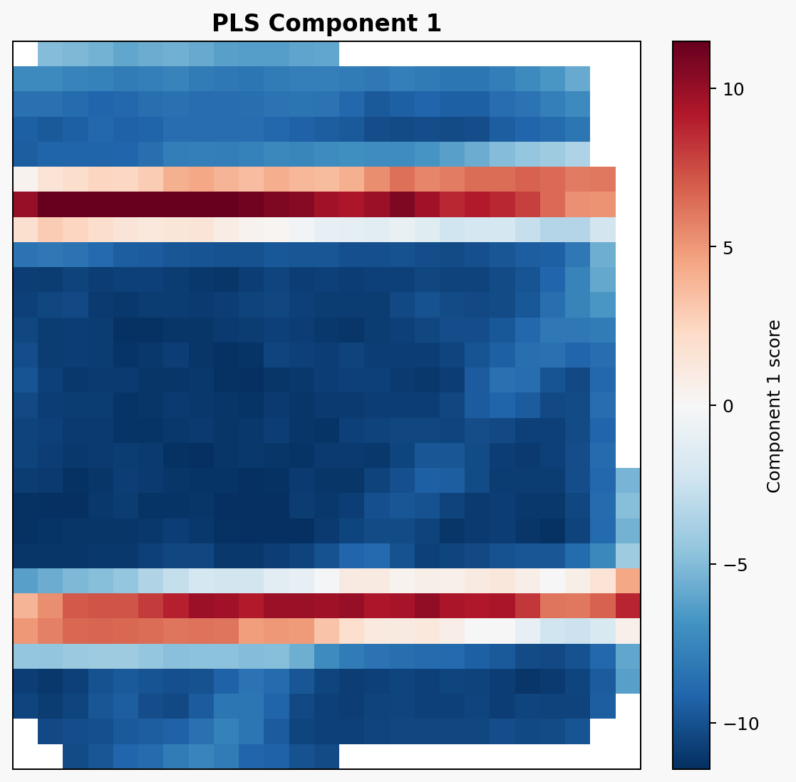
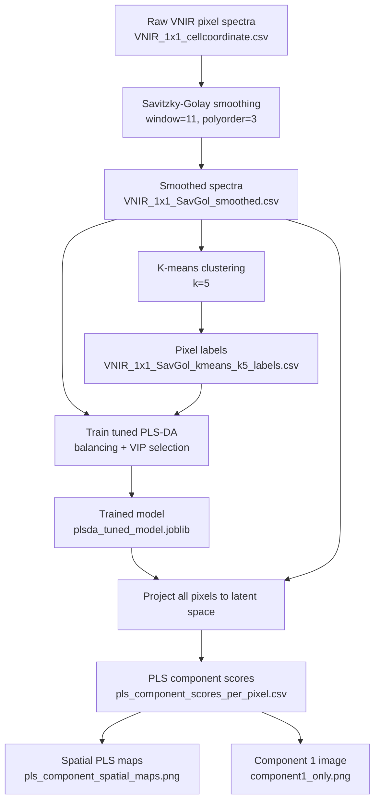

# PLS-DA Component 1 Workflow for PV Cell Crack Detection


End-to-end hyperspectral workflow for generating a **PLS-DA Component 1 image** that highlights PV cell crack-related spectral variation from VNIR pixel spectra.



## Quick Start

Run the full workflow from raw VNIR spectra to the final Component 1 image:

```powershell
python savitzky_golay_smoothing.py
python kmeans_k5_smoothed_pixels.py
python build_plsda_tuned_balanced_vip.py
python visualize_pls_components_spatial.py
python plot_component1_only.py
```

Main final output:
- `component1_only.png`

---

## Table of Contents

- [Overview](#overview)
- [Results](#results)
- [Workflow Diagram](#workflow-diagram)
- [Pipeline Stages](#pipeline-stages)
- [Inputs and Outputs](#inputs-and-outputs)
- [Scripts](#scripts)
- [How Component 1 Is Generated](#how-component-1-is-generated)
- [Optional Crack Products](#optional-crack-products)
- [Project Files](#project-files)

---

## Overview

This workflow starts from per-pixel VNIR reflectance spectra and produces a spatial **PLS latent component map** for the PV module.

The processing logic is:
1. Smooth raw spectra using Savitzky-Golay filtering.
2. Use k-means clustering to create pseudo-labels for each pixel.
3. Train a supervised PLS-DA model using the smoothed spectra and k-means labels.
4. Project all pixels into PLS latent space.
5. Visualize **PLS Component 1** spatially as an image.

---

## Results

### Main Output

| Output | Preview |
|---|---|
| `component1_only.png` |  |
| `plsda_tuned_confusion_matrix.png` |  |

### Optional Crack Products

| Output | Preview |
|---|---|
| `plsda_crack_map.png` |  |
| `component1_and_crack_map.png` |  |

---

## Workflow Diagram



---

## Pipeline Stages

<details>
<summary><strong>Expand Stage-by-Stage Details</strong></summary>

<br/>

### 1. Spectral Smoothing

**Script:** `savitzky_golay_smoothing.py`  
**Input:** `VNIR_1x1_cellcoordinate.csv`  
**Output:** `VNIR_1x1_SavGol_smoothed.csv`

Purpose:
- Reduce band-to-band noise while preserving spectral shape.

Core code:
```python
from scipy.signal import savgol_filter
smoothed = savgol_filter(spectra, window_length=11, polyorder=3, axis=1)
```

### 2. Pixel Label Generation via K-means

**Script:** `kmeans_k5_smoothed_pixels.py`  
**Input:** `VNIR_1x1_SavGol_smoothed.csv`  
**Output:** `VNIR_1x1_SavGol_kmeans_k5_labels.csv`

Purpose:
- Create pseudo-class labels for supervised PLS-DA training.

Core code:
```python
from sklearn.preprocessing import StandardScaler
from sklearn.cluster import KMeans

X_scaled = StandardScaler().fit_transform(X)
labels = KMeans(n_clusters=5, random_state=42, n_init=20).fit_predict(X_scaled)
```

### 3. Tuned PLS-DA Model Training

**Script:** `build_plsda_tuned_balanced_vip.py`  
**Inputs:**
- `VNIR_1x1_SavGol_smoothed.csv`
- `VNIR_1x1_SavGol_kmeans_k5_labels.csv`

**Outputs:**
- `plsda_tuned_model.joblib`
- `plsda_tuned_metrics.txt`
- `plsda_tuned_confusion_matrix.png`
- `plsda_cv_results.csv`
- `plsda_vip_scores.csv`

Purpose:
- Train a supervised model that separates spectral classes.
- Improve recall for minority clusters using balancing and VIP-based band selection.

Core code:
```python
from sklearn.cross_decomposition import PLSRegression

pls = PLSRegression(n_components=best_n_components)
pls.fit(X_train_balanced, Y_train_onehot)
```

### 4. Latent Component Projection

**Script:** `visualize_pls_components_spatial.py`  
**Inputs:**
- `VNIR_1x1_SavGol_smoothed.csv`
- `plsda_tuned_model.joblib`

**Outputs:**
- `pls_component_scores_per_pixel.csv`
- `pls_component_spatial_maps.png`

Purpose:
- Transform every pixel into PLS latent component scores.
- Create spatial maps for all latent components.

Core code:
```python
scores = model["pls_model"].transform(X_scaled)
```

### 5. Final Component 1 Image

**Script:** `plot_component1_only.py`  
**Input:** `pls_component_scores_per_pixel.csv`  
**Output:** `component1_only.png`

Purpose:
- Build the final spatial image of **PLS Component 1**.

Core code:
```python
grid[y - y_min, x - x_min] = comp1_values
plt.imshow(grid, cmap="RdBu_r", interpolation="nearest")
```

</details>

---

## Inputs and Outputs

| Stage | Input File(s) | Output File(s) |
|---|---|---|
| Spectral smoothing | `VNIR_1x1_cellcoordinate.csv` | `VNIR_1x1_SavGol_smoothed.csv` |
| K-means labeling | `VNIR_1x1_SavGol_smoothed.csv` | `VNIR_1x1_SavGol_kmeans_k5_labels.csv` |
| PLS-DA training | `VNIR_1x1_SavGol_smoothed.csv`, `VNIR_1x1_SavGol_kmeans_k5_labels.csv` | `plsda_tuned_model.joblib`, `plsda_tuned_metrics.txt`, `plsda_cv_results.csv`, `plsda_tuned_confusion_matrix.png` |
| PLS projection | `VNIR_1x1_SavGol_smoothed.csv`, `plsda_tuned_model.joblib` | `pls_component_scores_per_pixel.csv`, `pls_component_spatial_maps.png` |
| Final image | `pls_component_scores_per_pixel.csv` | `component1_only.png` |

---

## Scripts

<details>
<summary><strong>Expand Script Inventory</strong></summary>

<br/>

| Script | Role |
|---|---|
| `savitzky_golay_smoothing.py` | Smooth raw VNIR spectra |
| `kmeans_k5_smoothed_pixels.py` | Generate pseudo-labels using k-means |
| `build_plsda_tuned_balanced_vip.py` | Train tuned PLS-DA model |
| `apply_plsda_to_module.py` | Apply trained model to all pixels |
| `visualize_pls_components_spatial.py` | Compute and visualize latent PLS components |
| `plot_component1_only.py` | Create final single-image Component 1 visualization |
| `plot_component1_and_crack_map.py` | Create focused Component 1 and crack comparison figures |

</details>

---

## How Component 1 Is Generated

PLS-DA learns latent variables that best explain the relationship between spectral predictors and class labels.

For each pixel:
1. The selected spectral bands are scaled with the trained scaler.
2. The scaled spectrum is projected through the trained PLS model.
3. The first latent score becomes **PLS Component 1**.
4. The Component 1 values are reshaped using `File X` and `File Y` into a 2D image.

In this dataset, Component 1 behaves primarily like a **global reflectance/brightness axis**, which is why it highlights crack-related low-reflectance structure clearly.

---

## Optional Crack Products

If you also want crack classification products from the trained model, run:

```powershell
python apply_plsda_to_module.py
python plot_component1_and_crack_map.py
```

Optional outputs:
- `plsda_class_score_maps.png`
- `plsda_final_class_map.png`
- `plsda_crack_map.png`
- `plsda_crack_extent_summary.txt`
- `component1_and_crack_map.png`
- `component1_and_crack_map_enhanced.png`

---

## Project Files

Recommended files to showcase in a repository:
- `README.md`
- `component1_only.png`
- `pls_component_spatial_maps.png`
- `plsda_tuned_confusion_matrix.png`
- `plsda_tuned_metrics.txt`
- `plsda_cv_results.csv`

For a longer stage-by-stage documentation version, see:
- `README_PLSDA_Component1_Workflow.md`

---

## Citation-Style Summary

**Input:** VNIR hyperspectral reflectance per pixel  
**Model:** tuned PLS-DA with class balancing and VIP-based band selection  
**Primary visualization:** `component1_only.png`  
**Use case:** spatial highlighting of crack-related low-reflectance variation in PV cells
